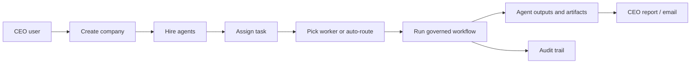
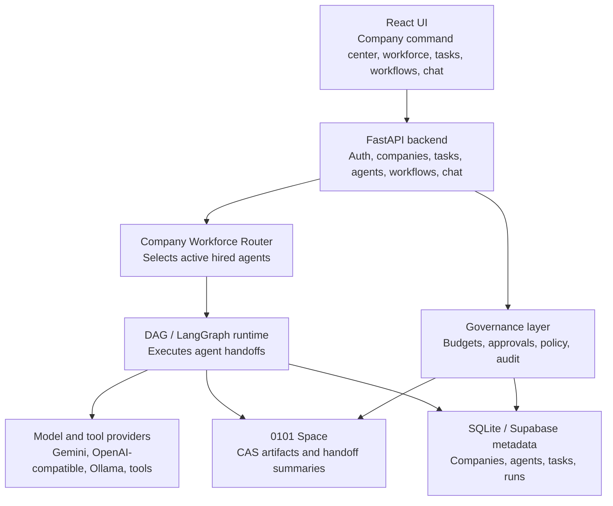

# 0101

0101 is an AI company operating system.

Users act as the CEO. They create a company, hire AI agents into departments, assign work, run the work through a governed execution engine, and receive auditable reports when the work is done.

The product looks simple on the surface:

1. Create a company.
2. Hire agents.
3. Assign a task.
4. Pick a worker or let 0101 route it.
5. Run the task.
6. Review outputs, previews, files, reports, and audit history.

Under the hood, every task becomes a controlled agent workflow with budget checks, tool policy, status tracking, artifacts, and logs.

## What 0101 Is

0101 is not a generic chatbot and not a loose agent playground.

It is a governed operating layer for AI work:

- Companies are workspaces.
- Departments organize workers.
- Agents are hired from a skill catalog.
- Tasks are one-time CEO assignments.
- Workflows are reusable or recurring operating procedures.
- Runs are the execution records.
- Reports are the CEO-ready output.
- Audit logs explain what happened.

## Product Model

| Product concept | Meaning |
| --- | --- |
| Company | A user-owned workspace with its own workforce, tasks, workflows, runs, and audit history |
| Department | A team inside the company, such as Engineering, Research, Marketing, Compliance, or Operations |
| Agent | A hired AI worker based on an existing skill definition |
| Task | One-time work assigned by the CEO to one or more agents |
| Workflow | A reusable or recurring process created from a task or advanced editor |
| Run | A single execution of a task or workflow |
| Report | The final CEO-readable result, optionally emailed on completion |
| Audit | The record of decisions, execution events, artifacts, and costs |

## Core Flow



## Architecture At A Glance



For the full architecture, read [docs/0101-architecture.md](./docs/0101-architecture.md).

## Repository Map

| Path | Purpose |
| --- | --- |
| `core/governance.py` | Main FastAPI app and governance API |
| `core/company_routes.py` | Company, department, workforce, task, and report APIs |
| `core/dag_engine.py` | Workflow execution engine and task-run synchronization |
| `core/managed_agent.py` | Agent runtime wrapper |
| `core/ensemble_space.py` | Content-addressable artifact storage |
| `core/audit.py` | Audit logging |
| `core/skill_registry.py` | Skill and agent catalog |
| `directives/` | SOP/directive definitions |
| `skills/` | Native skill markdown files |
| `ui/` | React frontend |
| `schema/` | Supabase schema and RLS migrations |
| `docs/` | Architecture and operations docs |

## Local Development

Start the backend:

```bash
python -m uvicorn core.governance:app --host 127.0.0.1 --port 8088
```

Start the frontend:

```bash
cd ui
npm install
npm run dev
```

Open the Vite URL, usually:

```text
http://127.0.0.1:5173
```

For full setup, environment variables, SMTP report delivery, and smoke tests, read [docs/operations.md](./docs/operations.md).

## Verification

Useful checks:

```bash
python -m pytest tests/test_company_routes.py
python -m py_compile core/company_routes.py core/governance.py core/dag_engine.py
cd ui && npm run build && npm run lint
```

## Current Product Priorities

1. Make the company operating model feel real: hire, fire, assign, run, report.
2. Keep workflow/DAG logic powerful but hidden behind simple CEO actions.
3. Make outputs easy to inspect: agent cards, preview, files, report, timeline.
4. Keep audit, policy, budget, and approval behavior visible.
5. Keep the UI minimal, matte black, liquid-glass, and production-grade.

## Documentation

The docs are intentionally small:

| File | Use |
| --- | --- |
| [docs/0101-architecture.md](./docs/0101-architecture.md) | Product and technical architecture |
| [docs/operations.md](./docs/operations.md) | Local setup, deployment, SMTP reports, and troubleshooting |
