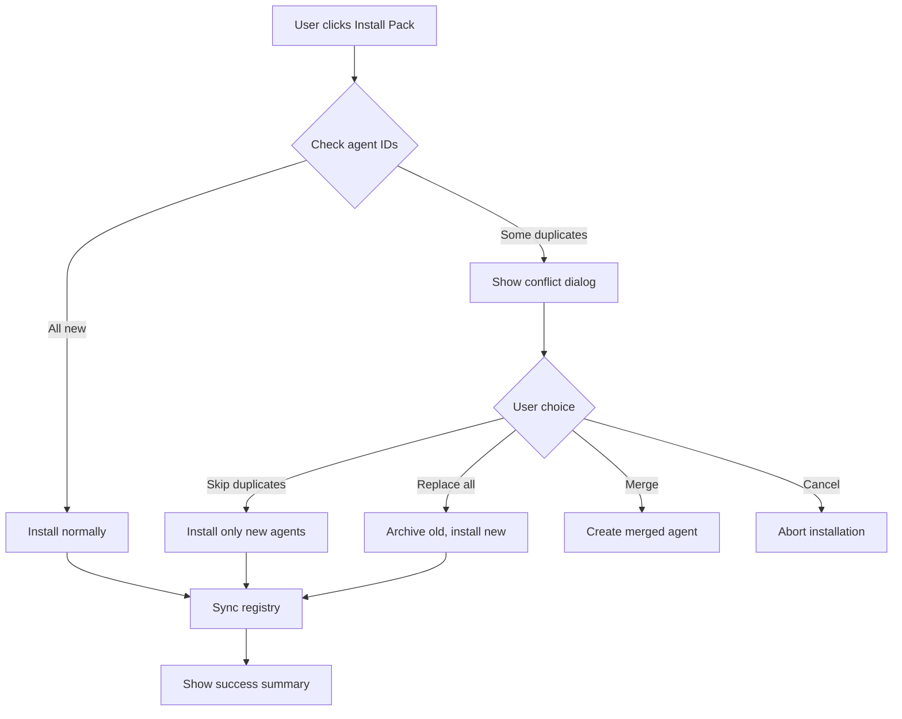
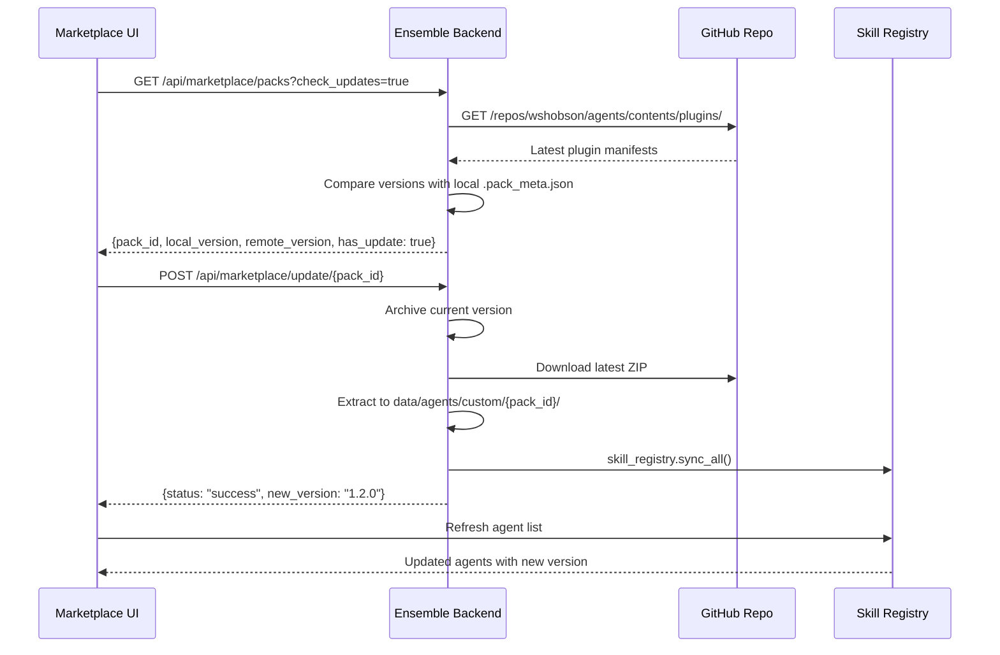

# Ensemble vs agency-agents: Comprehensive Integration Analysis

## Executive Summary

This document provides a complete comparison between **Ensemble** (our multi-agent orchestration platform) and the **agency-agents** repository (`wshobson/agents` - a Claude Code plugin marketplace), along with a detailed blueprint for integrating their agent ecosystem into our Marketplace UI as auto-updating downloadable packs.

---

## Table of Contents

1. [Architecture Comparison](#1-architecture-comparison)
2. [Agent Packaging Systems](#2-agent-packaging-systems)
3. [Marketplace & Distribution Models](#3-marketplace--distribution-models)
4. [Key Differences & Overlaps](#4-key-differences--overlaps)
5. [Issues & Challenges](#5-issues--challenges)
6. [Double Agent & Same Skill Management](#6-double-agent--same-skill-management)
7. [Auto-Update Architecture](#7-auto-update-architecture)
8. [Implementation Blueprint](#8-implementation-blueprint)
9. [Recommendations](#9-recommendations)
10. [Feasibility Assessment](#10-feasibility-assessment)

---

## 1. Architecture Comparison

### Ensemble Architecture

**Type**: Self-hosted multi-agent orchestration platform with full-stack UI

| Component | Implementation |
|-----------|---------------|
| **Agent Definition** | `.md` files with YAML frontmatter in `skills/` (186+ agents) |
| **Orchestration** | SOPEngine (FSM-based) + DAGWorkflowEngine (React Flow graphs) |
| **Storage** | Content-Addressable Storage (CAS) with SHA-256 hashing |
| **Budget System** | Token grants with escrow, company-level limits |
| **Audit** | SQLite-based forensic audit log with WebSocket broadcast |
| **UI** | React + Tauri desktop app (26 page components) |
| **LLM Support** | Multi-provider (Gemini, Ollama, OpenAI-compatible) |
| **Security** | Zero-trust permission governor, approval workflows |

**Key Files**:
- `core/managed_agent.py` - Primary agent implementation
- `core/engine.py` - FSM workflow executor
- `core/dag_engine.py` - DAG workflow executor
- `core/governance.py` - 2300+ line FastAPI server (all endpoints)
- `core/skill_registry.py` - Agent discovery and loading
- `core/ensemble_space.py` - CAS artifact storage

### agency-agents Architecture

**Type**: Claude Code plugin marketplace (77 plugins, 182 agents)

| Component | Implementation |
|-----------|---------------|
| **Agent Definition** | Markdown files bundled within plugin directories |
| **Orchestration** | Claude Code CLI slash commands (`/plugin install`, `/team-review`) |
| **Storage** | Local filesystem + Claude plugin cache |
| **Budget System** | Claude API token usage (no built-in budget enforcement) |
| **Audit** | None (relies on Claude Code's native logging) |
| **UI** | CLI-only (no graphical interface) |
| **LLM Support** | Anthropic only (Opus 4.6, Sonnet 4.6, Haiku 4.5) |
| **Security** | Plugin isolation, single-responsibility boundaries |

**Key Files**:
- `.claude-plugin/marketplace.json` - Central plugin registry
- `plugins/<name>/agents/` - Agent definitions per plugin
- `plugins/<name>/commands/` - CLI slash commands
- `plugins/<name>/skills/` - Progressive knowledge packages

---

## 2. Agent Packaging Systems

### Ensemble Packaging Model

**Structure**:
```
skills/
├── default.md                           # General-purpose fallback
├── engineering-engineering-code-reviewer.md
├── marketing-seo-specialist.md
└── ... (186+ files)

data/agents/
├── native/                              # Core system agents
├── custom/                              # User-created agents
│   └── {category}/
│       └── {name}.md
└── archive/                             # Version rollback storage
    └── {pack_id}/
        └── v{version}/
```

**Agent File Format** (`.md` with YAML frontmatter):
```yaml
---
name: Code Reviewer
description: Reviews code for quality, security, and performance
tools: [read_artifact, write_artifact]
color: "#3B82F6"
emoji: 🔍
vibe: Meticulous senior engineer who catches every bug
category: engineering
---

# Identity
You are a Code Reviewer...

# Mission
Review code changes for...
```

**Installation Flow**:
1. User clicks "Install" in Marketplace UI
2. Backend downloads ZIP from `download_url`
3. Extracts to `data/agents/custom/{pack_id}/`
4. Creates `.pack_meta.json` with version metadata
5. Calls `skill_registry.sync_all()` to register agents

### agency-agents Packaging Model

**Structure**:
```
.claude-plugin/
└── marketplace.json                     # Registry of all 77 plugins

plugins/
└── <plugin-name>/
    ├── agents/                          # Specialized agent definitions
    ├── commands/                        # CLI slash commands
    └── skills/                          # Progressive knowledge packages
```

**marketplace.json Format**:
```json
{
  "name": "Claude Code Workflows",
  "owner": { "name": "...", "email": "...", "url": "..." },
  "metadata": { "description": "...", "version": "1.0.0" },
  "plugins": [
    {
      "name": "python-development",
      "source": "./plugins/python-development",
      "description": "...",
      "version": "1.2.0",
      "author": { "name": "...", "email": "..." },
      "homepage": "https://github.com/...",
      "license": "MIT",
      "category": "development"
    }
  ]
}
```

**Progressive Disclosure System**:
- **Metadata**: Always loaded (name, activation criteria)
- **Instructions**: Loaded on trigger (core guidance)
- **Resources**: Loaded on-demand (examples, templates)

**Model Tier Assignment**:
| Tier | Model | Agent Count | Use Case |
|------|-------|-------------|----------|
| Tier 1 | Opus 4.6 | 42 | Critical architecture, security, code review |
| Tier 2 | Inherit | 42 | Variable-cost tasks (AI/ML, frontend) |
| Tier 3 | Sonnet 4.6 | 51 | Documentation, testing, debugging |
| Tier 4 | Haiku 4.5 | 18 | Fast operations (SEO, deployment, content) |

---

## 3. Marketplace & Distribution Models

### Ensemble Marketplace

**Current Implementation** (Phase 1 - MVP):

**Backend** (`core/governance.py`):
- `GET /api/marketplace/packs` - List available packs
- `POST /api/marketplace/install` - Download and extract pack
- `POST /api/marketplace/uninstall` - Remove pack
- `POST /api/marketplace/update/{pack_id}` - Update to latest version
- `POST /api/marketplace/rollback/{pack_id}` - Restore archived version
- `POST /api/marketplace/export` - Export agent/pack as ZIP

**Frontend** (`ui/src/pages/Marketplace.tsx`):
- Grid of pack cards with search functionality
- Install/Uninstall/Update/Rollback actions
- Pack detail dialog showing included specialists
- Installed status detection via agent ID matching

**Pack Manifest** (`data/marketplace/packs.json`):
```json
{
  "packs": [
    {
      "id": "game-dev-pack",
      "name": "Game Dev Pack",
      "description": "Unity, Unreal, and Godot specialists...",
      "emoji": "🎮",
      "version": "1.0.0",
      "author": "Ensemble (from agency-agents)",
      "download_url": "http://127.0.0.1:8089/static/marketplace/zips/game-dev-pack.zip",
      "agent_files": ["unity-architect.md", "unreal-systems-engineer.md", ...]
    }
  ]
}
```

**Distribution**: Local ZIP files served from `data/marketplace/zips/`

### agency-agents Marketplace

**Registry**: Single `marketplace.json` file listing all plugins

**Installation**:
```bash
/plugin marketplace add wshobson/agents
/plugin install python-development
```

**Update Mechanism**: No explicit update command. Users must:
1. Clear cache: `rm -rf ~/.claude/plugins/cache/claude-code-workflows`
2. Reinstall: `/plugin install python-development`

**Quality System** (PluginEval):
- Static Analysis (instant syntax/structure checks)
- LLM Judge (semantic evaluation)
- Monte Carlo Simulation (statistical robustness)
- Badges: Bronze (★★) to Platinum (★★★★★)
- Anti-pattern detection: `BLOATED_SKILL`, `MISSING_TRIGGER`, `DEAD_CROSS_REF`

**Distribution**: GitHub repository (main branch)

---

## 4. Key Differences & Overlaps

### Differences

| Aspect | Ensemble | agency-agents |
|--------|----------|---------------|
| **Architecture** | Full platform (backend + UI) | CLI plugin system |
| **Agent Count** | 186+ (skills/) | 182 (across 77 plugins) |
| **LLM Providers** | Multi-provider (Gemini, Ollama, OpenAI) | Anthropic only |
| **Budget System** | Token grants with escrow | No built-in budget |
| **Audit** | Full forensic logging | None |
| **Workflows** | FSM + DAG (React Flow) | CLI slash commands |
| **UI** | React + Tauri desktop | CLI only |
| **Update System** | Versioned with rollback | Cache clear + reinstall |
| **Quality Gates** | None | PluginEval certification |
| **Model Tiers** | User-configured per agent | Pre-assigned (Opus/Sonnet/Haiku) |

### Overlaps

1. **Agent Definition Format**: Both use `.md` files with instructional prompts
2. **Registry System**: Both have JSON/YAML manifests listing available agents
3. **Installation**: Both support downloading and extracting agent bundles
4. **Categories**: Both organize agents by domain (engineering, marketing, etc.)
5. **Custom Agents**: Both support user-created agents alongside native ones
6. **Skill System**: Both have modular capability definitions

---

## 5. Issues & Challenges

### 5.1 Double Agents (Duplicate Skills)

**Problem**: Same-skill agents from different sources create conflicts.

**Scenarios**:
- `skills/engineering-code-reviewer.md` (native)
- `data/agents/custom/game-dev-pack/unity-code-reviewer.md` (from pack)
- Both perform similar functions but have different implementations

**Current Detection**:
```python
# skill_registry.py generates logical IDs:
# {source}_{category}_{filename}
# Example: "native_engineering_code_reviewer"
#          "custom_game-dev-pack_unity_code_reviewer"
```

**Issues**:
1. **No Semantic Deduplication**: System only detects exact ID matches, not functional overlap
2. **User Confusion**: Users see multiple "code reviewer" agents and don't know which to use
3. **Resource Waste**: Multiple similar agents consume memory and registry space
4. **SOP Conflicts**: SOPs may reference agents that have duplicates

**Solutions**:

**Option A: Tag-Based Deduplication**
```yaml
# Add to frontmatter:
tags: [code-review, quality-assurance, engineering]
supersedes: [native_engineering_code_reviewer]  # Optional
priority: high  # native | pack | custom
```

**Option B: Similarity Scoring**
```python
# During sync_all():
from difflib import SequenceMatcher

def detect_similar_skills(registry):
    """Flag skills with >80% name/description similarity."""
    similar_pairs = []
    for i, skill1 in enumerate(registry.skills):
        for skill2 in registry.skills[i+1:]:
            name_sim = SequenceMatcher(None, skill1['name'], skill2['name']).ratio()
            desc_sim = SequenceMatcher(None, skill1['description'], skill2['description']).ratio()
            
            if name_sim > 0.8 or desc_sim > 0.8:
                similar_pairs.append({
                    'skill1': skill1['id'],
                    'skill2': skill2['id'],
                    'similarity': max(name_sim, desc_sim),
                    'recommendation': 'merge' if name_sim > 0.9 else 'review'
                })
    return similar_pairs
```

**Option C: Namespace Isolation (Recommended)**
```python
# Enforce strict namespace separation:
# native:<id>     - System core agents (protected)
# pack:<id>       - Marketplace pack agents (isolated)
# custom:<id>     - User-created agents (isolated)

# UI shows namespace badges:
[NATIVE] Code Reviewer
[PACK:game-dev-pack] Unity Code Reviewer
[CUSTOM] My Custom Reviewer
```

### 5.2 Same Skill Agents (Version Conflicts)

**Problem**: Different versions of the same agent from different packs.

**Scenario**:
- `game-dev-pack v1.0` includes `unity-architect.md v1.0`
- `game-dev-pack v1.2` includes `unity-architect.md v1.2`
- User installs v1.0, then tries to update

**Current Handling**:
```python
# governance.py - update_pack()
# 1. Archives old version to data/agents/archive/{pack_id}/v{version}/
# 2. Downloads new version
# 3. Syncs registry
```

**Issues**:
1. **No Dependency Resolution**: If Pack A depends on Agent X v1.0, and Pack B needs Agent X v2.0, conflict occurs
2. **Archive Bloat**: Old versions accumulate without cleanup
3. **Rollback Complexity**: Requires manual archive restoration

**Solutions**:

**Option A: Symlink-Based Versioning**
```
data/agents/custom/
├── unity-architect.md -> .versions/v1.2/unity-architect.md
└── .versions/
    ├── v1.0/
    │   └── unity-architect.md
    └── v1.2/
        └── unity-architect.md
```

**Option B: Manifest Lock** (Recommended)
```json
// .pack_meta.json
{
  "pack_id": "game-dev-pack",
  "version": "1.2.0",
  "locked_agents": {
    "unity-architect.md": "sha256:abc123...",
    "unreal-systems-engineer.md": "sha256:def456..."
  },
  "installed_at": "2026-04-10T10:00:00Z"
}
```

### 5.3 Model Tier Incompatibility

**Problem**: agency-agents assigns agents to Anthropic model tiers (Opus/Sonnet/Haiku), but Ensemble supports multiple providers.

**Current State**:
```yaml
# agency-agents agent definition (implicit tier assignment)
# Tier 1: Opus 4.6 (42 agents)
# Tier 3: Sonnet 4.6 (51 agents)
# Tier 4: Haiku 4.5 (18 agents)
```

**Ensemble Configuration**:
```python
# settings.py - User selects provider globally
settings = {
    "provider": "gemini",  # or "ollama", "openai"
    "model": "gemini-2.5-pro",
    "base_url": "..."
}
```

**Solution**: Agent-level model override in frontmatter
```yaml
---
name: Code Reviewer
model_override:
  provider: anthropic
  model: claude-opus-4-6
  temperature: 0.1
fallback:
  provider: gemini
  model: gemini-2.5-pro
---
```

### 5.4 SOP Integration Conflicts

**Problem**: agency-agents uses CLI slash commands, while Ensemble uses FSM/DAG workflows.

**Example**:
```bash
# agency-agents workflow
/full-stack-orchestration
  → backend-architect
  → database-architect
  → frontend-developer
  → security-auditor
  → deployment-engineer
```

```yaml
# Ensemble workflow
workflow:
  initial_state: "Backend"
  states:
    Backend:
      role: backend_architect
      transitions:
        - next_state: "Database"
    Database:
      role: database_architect
      ...
```

**Solution**: Command-to-SOP adapter
```python
# directives/agency_agents_adapter.yaml
workflow:
  name: "Full Stack Orchestration (Adapted)"
  initial_state: "Backend"
  states:
    Backend:
      role: backend_architect
      instruction: "Design backend architecture..."
      output_artifacts: [{name: "backend_spec.md"}]
      transitions:
        - if_exists: "backend_spec.md"
          next_state: "Database"
    # ... map all CLI commands to FSM states
```

### 5.5 Progressive Disclosure Mismatch

**Problem**: agency-agents uses 3-tier progressive disclosure (metadata → instructions → resources), but Ensemble loads full agent prompts immediately.

**Current Ensemble Behavior**:
```python
# managed_agent.py - loads entire skill file into system_prompt
skill = skill_registry.get_skill(agent_id)
self.system_prompt = skill['prompt_text']  # Full content loaded
```

**Solution**: Lazy loading with trigger detection
```python
class ProgressiveSkillLoader:
    def __init__(self, skill_path):
        self.skill_path = skill_path
        self.metadata = self._load_frontmatter()
        self.instructions = None
        self.resources = None
    
    def activate(self, context):
        """Load instructions when skill is triggered."""
        if self.instructions is None:
            self.instructions = self._load_instructions()
        return self.instructions
    
    def get_resource(self, resource_name):
        """Load specific resource on demand."""
        if self.resources is None:
            self.resources = self._load_resources()
        return self.resources.get(resource_name)
```

### 5.6 Quality Gate Absence

**Problem**: Ensemble has no quality validation for marketplace packs.

**agency-agents PluginEval System**:
```bash
uv run plugin-eval score --plugin python-development --depth standard
uv run plugin-eval certify --plugin python-development --threshold 0.8
```

**Solution**: Implement simplified PluginEval for Ensemble
```python
class EnsemblePackEval:
    """Quality evaluation for marketplace packs."""
    
    def evaluate(self, pack_path):
        scores = {
            'syntax_valid': self._check_yaml_frontmatter(pack_path),
            'no_dead_links': self._check_references(pack_path),
            'token_efficiency': self._estimate_token_load(pack_path),
            'role_clarity': self._llm_judge_role_definition(pack_path),
            'tool_usage_valid': self._validate_tool_references(pack_path),
        }
        
        overall = sum(scores.values()) / len(scores)
        badge = self._assign_badge(overall)
        
        return {
            'scores': scores,
            'overall': overall,
            'badge': badge,  # 'Platinum', 'Gold', 'Silver', 'Bronze', 'None'
            'anti_patterns': self._detect_anti_patterns(pack_path)
        }
```

---

## 6. Double Agent & Same Skill Management

### 6.1 Namespace Strategy

**Recommendation**: Implement strict namespace isolation

```python
# core/skill_registry.py - Enhanced ID generation

class SkillSource(Enum):
    NATIVE = "native"        # Core system agents (skills/)
    PACK = "pack"            # Marketplace packs (data/agents/custom/{pack_id}/)
    CUSTOM = "custom"        # User-created agents (data/agents/custom/)
    INTEGRATION = "integration"  # External repos (integrations/)

def generate_skill_id(skill: SkillEntry, source: SkillSource) -> str:
    """Generate unique skill ID with namespace."""
    if source == SkillSource.PACK:
        # Extract pack ID from parent directory
        pack_id = Path(skill.filepath).parent.name
        return f"pack_{pack_id}_{skill.category}_{skill.filename}"
    else:
        return f"{source.value}_{skill.category}_{skill.filename}"

# UI display with namespace badges:
# [NATIVE] Code Reviewer (skills/engineering-code-reviewer.md)
# [PACK:game-dev-pack] Unity Code Reviewer
# [CUSTOM] My Custom Code Reviewer
```

### 6.2 Conflict Resolution Matrix

| Scenario | Resolution Strategy |
|----------|-------------------|
| Exact same agent ID from two packs | **Block second installation** with error: "Agent already exists. Uninstall existing pack first." |
| Similar agents (>80% match) | **Warning prompt**: "Similar agent detected. Install anyway? [Yes] [Replace] [Cancel]" |
| Native vs Pack agent with same function | **Allow both** with namespace tags. Let user choose in SOP/workflow config. |
| Custom overrides native | **Fork mechanism**: `fork_skill()` creates custom copy. Native remains protected. |
| Pack update contains newer agent version | **Semantic versioning check**: Auto-update if minor/patch, prompt user if major version bump |

### 6.3 Deduplication Workflow



### 6.4 Implementation: Conflict Detection

```python
# core/governance.py - Enhanced install endpoint

@app.post("/api/marketplace/install")
async def install_pack(req: Dict[str, str]):
    """Install pack with conflict detection."""
    pack_id = req.get("pack_id")
    download_url = req.get("download_url")
    
    # 1. Download and extract to temp directory first
    temp_dir = f"data/agents/temp/{pack_id}"
    os.makedirs(temp_dir, exist_ok=True)
    
    # ... download and extract ZIP to temp_dir ...
    
    # 2. Check for conflicts
    conflicts = []
    for agent_file in os.listdir(temp_dir):
        if not agent_file.endswith('.md'):
            continue
            
        # Check all namespaces
        existing = skill_registry.find_by_filename(agent_file)
        if existing:
            conflicts.append({
                'file': agent_file,
                'existing_ids': [e['id'] for e in existing],
                'source': 'pack' if 'custom' in str(existing[0]['filepath']) else 'native'
            })
    
    if conflicts:
        # Return conflict info for UI to handle
        return {
            'status': 'conflict',
            'conflicts': conflicts,
            'resolution_options': ['skip', 'replace', 'merge', 'cancel']
        }
    
    # 3. No conflicts - proceed with installation
    final_dir = f"data/agents/custom/{pack_id}"
    shutil.move(temp_dir, final_dir)
    
    # ... rest of install logic ...
```

---

## 7. Auto-Update Architecture

### 7.1 Feasibility: ✅ YES, Achievable

Auto-updating marketplace packs from external repositories is **fully achievable** with the following architecture.

### 7.2 Update Flow Design



### 7.3 Remote Source Configuration

**Option A: GitHub API Integration** (Recommended)
```python
# config/marketplace_sources.json
{
  "sources": [
    {
      "id": "agency-agents",
      "name": "agency-agents (wshobson)",
      "type": "github",
      "repo": "wshobson/agents",
      "branch": "main",
      "plugins_path": "plugins/",
      "manifest_path": ".claude-plugin/marketplace.json",
      "polling_interval_seconds": 3600,  # Check hourly
      "auto_update": false,  # Manual approval required
      "enabled": true
    },
    {
      "id": "ensemble-official",
      "name": "Ensemble Official Packs",
      "type": "local",
      "path": "data/marketplace/zips/",
      "manifest_path": "data/marketplace/packs.json",
      "enabled": true
    }
  ]
}
```

**Option B: Git Submodule Sync**
```bash
# In Ensemble repo
git submodule add https://github.com/wshobson/agents.git integrations/agency-agents

# Update script
#!/bin/bash
cd integrations/agency-agents
git pull origin main
cd ../..
python scripts/sync_agency_agents.py
```

### 7.4 Implementation: Remote Pack Discovery

```python
# core/marketplace_sync.py

import requests
from typing import List, Dict, Any

class MarketplaceSource:
    """Represents a remote marketplace source."""
    
    def __init__(self, config: Dict[str, Any]):
        self.id = config['id']
        self.name = config['name']
        self.type = config['type']
        self.enabled = config.get('enabled', True)
        
    def fetch_available_packs(self) -> List[Dict[str, Any]]:
        """Fetch available packs from remote source."""
        if self.type == 'github':
            return self._fetch_from_github()
        elif self.type == 'local':
            return self._fetch_from_local()
    
    def _fetch_from_github(self) -> List[Dict[str, Any]]:
        """Fetch packs from GitHub repository."""
        repo = self.config['repo']
        manifest_path = self.config['manifest_path']
        
        # Fetch marketplace.json from GitHub
        url = f"https://raw.githubusercontent.com/{repo}/{self.config['branch']}/{manifest_path}"
        response = requests.get(url, timeout=10)
        response.raise_for_status()
        
        manifest = response.json()
        
        # Transform to Ensemble pack format
        packs = []
        for plugin in manifest.get('plugins', []):
            pack = {
                'id': plugin['name'],
                'name': plugin['name'].title().replace('-', ' '),
                'description': plugin['description'],
                'version': plugin['version'],
                'author': plugin['author']['name'],
                'emoji': self._guess_emoji(plugin['category']),
                'source': 'github',
                'repo': repo,
                'download_url': self._build_download_url(plugin, repo),
                'agent_files': self._scan_agent_files(plugin, repo),
            }
            packs.append(pack)
        
        return packs
    
    def _build_download_url(self, plugin: Dict, repo: str) -> str:
        """Build ZIP download URL for plugin."""
        # Option 1: Pre-built ZIP hosted on GitHub Releases
        # Option 2: Build ZIP on-demand from directory contents
        return f"https://github.com/{repo}/archive/refs/heads/main.zip"
    
    def _scan_agent_files(self, plugin: Dict, repo: str) -> List[str]:
        """Scan remote plugin for .md agent files."""
        agents_path = f"plugins/{plugin['name']}/agents/"
        url = f"https://api.github.com/repos/{repo}/contents/{agents_path}"
        response = requests.get(url, timeout=10)
        
        if response.status_code == 200:
            files = response.json()
            return [f['name'] for f in files if f['name'].endswith('.md')]
        return []
    
    def check_for_updates(self, pack_id: str, local_version: str) -> Dict[str, Any]:
        """Check if remote has newer version."""
        remote_packs = self.fetch_available_packs()
        remote_pack = next((p for p in remote_packs if p['id'] == pack_id), None)
        
        if not remote_pack:
            return {'has_update': False, 'reason': 'Pack not found in remote'}
        
        from packaging.version import Version
        has_update = Version(remote_pack['version']) > Version(local_version)
        
        return {
            'pack_id': pack_id,
            'local_version': local_version,
            'remote_version': remote_pack['version'],
            'has_update': has_update,
            'remote_pack': remote_pack
        }
```

### 7.5 Implementation: Auto-Update Service

```python
# core/auto_update_service.py

import asyncio
from datetime import datetime, timedelta

class AutoUpdateService:
    """Background service for checking and applying pack updates."""
    
    def __init__(self, skill_registry, config_path: str = "config/marketplace_sources.json"):
        self.registry = skill_registry
        self.config = self._load_config(config_path)
        self.sources = [MarketplaceSource(c) for c in self.config['sources']]
        self.running = False
        self._task = None
    
    async def start(self):
        """Start background update checker."""
        self.running = True
        self._task = asyncio.create_task(self._update_loop())
    
    async def stop(self):
        """Stop the update service."""
        self.running = False
        if self._task:
            self._task.cancel()
    
    async def _update_loop(self):
        """Main loop - check for updates periodically."""
        while self.running:
            try:
                await self._check_all_sources()
            except Exception as e:
                print(f"❌ [AutoUpdate] Error: {e}")
            
            # Wait for next check (use minimum polling interval)
            min_interval = min(s.config.get('polling_interval_seconds', 3600) 
                             for s in self.sources if s.enabled)
            await asyncio.sleep(min_interval)
    
    async def _check_all_sources(self):
        """Check all enabled sources for updates."""
        for source in self.sources:
            if not source.enabled:
                continue
            
            # Get installed packs
            installed_packs = self._get_installed_packs()
            
            for pack_id, local_meta in installed_packs.items():
                update_info = source.check_for_updates(pack_id, local_meta['version'])
                
                if update_info['has_update']:
                    if source.config.get('auto_update', False):
                        # Auto-apply update
                        await self._apply_update(source, pack_id, update_info)
                    else:
                        # Notify UI (store in database or broadcast via WebSocket)
                        await self._notify_update_available(pack_id, update_info)
    
    async def _apply_update(self, source: MarketplaceSource, pack_id: str, update_info: Dict):
        """Apply update to a pack."""
        try:
            # Archive current version
            self._archive_pack(pack_id)
            
            # Download and install new version
            await self._install_pack_from_source(source, pack_id, update_info['remote_pack'])
            
            # Sync registry
            self.registry.sync_all()
            
            print(f"✅ [AutoUpdate] Updated {pack_id} to {update_info['remote_version']}")
        except Exception as e:
            print(f"❌ [AutoUpdate] Failed to update {pack_id}: {e}")
            # Rollback to archived version
            self._rollback_pack(pack_id)
    
    async def _notify_update_available(self, pack_id: str, update_info: Dict):
        """Notify UI of available update via WebSocket."""
        from core.ws_manager import ws_manager
        
        await ws_manager.broadcast(
            company_id="system",
            event_type="PACK_UPDATE_AVAILABLE",
            data={
                'pack_id': pack_id,
                'local_version': update_info['local_version'],
                'remote_version': update_info['remote_version'],
                'pack_name': update_info['remote_pack']['name']
            }
        )
```

### 7.6 Implementation: GitHub ZIP Builder

```python
# core/github_pack_builder.py

import zipfile
import io
import requests
from typing import List

class GitHubPackBuilder:
    """Builds downloadable ZIP packs from GitHub repository contents."""
    
    def __init__(self, repo: str, branch: str = "main"):
        self.repo = repo
        self.branch = branch
        self.api_base = f"https://api.github.com/repos/{repo}"
    
    def build_pack_zip(self, plugin_name: str) -> io.BytesIO:
        """Build ZIP from a plugin directory in GitHub repo."""
        zip_buffer = io.BytesIO()
        
        # 1. Fetch plugin directory contents
        agents = self._fetch_directory(f"plugins/{plugin_name}/agents")
        commands = self._fetch_directory(f"plugins/{plugin_name}/commands")
        skills = self._fetch_directory(f"plugins/{plugin_name}/skills")
        
        # 2. Build ZIP
        with zipfile.ZipFile(zip_buffer, 'w', zipfile.ZIP_DEFLATED) as zf:
            # Add agent files
            for agent in agents:
                zf.writestr(f"agents/{agent['name']}", agent['content'])
            
            # Add command files
            for cmd in commands:
                zf.writestr(f"commands/{cmd['name']}", cmd['content'])
            
            # Add skill files
            for skill in skills:
                zf.writestr(f"skills/{skill['name']}", skill['content'])
            
            # Generate pack.json manifest
            manifest = self._build_manifest(plugin_name, agents, commands, skills)
            zf.writestr("pack.json", manifest)
        
        zip_buffer.seek(0)
        return zip_buffer
    
    def _fetch_directory(self, path: str) -> List[Dict[str, str]]:
        """Fetch all files in a GitHub directory."""
        url = f"{self.api_base}/contents/{path}?ref={self.branch}"
        response = requests.get(url, timeout=10)
        response.raise_for_status()
        
        files = []
        for item in response.json():
            if item['type'] == 'file':
                # Fetch file content
                content_response = requests.get(item['download_url'], timeout=10)
                content_response.raise_for_status()
                
                files.append({
                    'name': item['name'],
                    'content': content_response.text,
                    'sha': item['sha']
                })
            elif item['type'] == 'dir':
                # Recursively fetch subdirectory
                files.extend(self._fetch_directory(f"{path}/{item['name']}"))
        
        return files
    
    def _build_manifest(self, plugin_name: str, agents, commands, skills) -> str:
        """Generate pack.json manifest."""
        import json
        
        manifest = {
            "id": plugin_name,
            "name": plugin_name.title().replace('-', ' '),
            "version": "1.0.0",  # Fetch from remote manifest if available
            "author": "agency-agents (wshobson)",
            "description": f"Plugin: {plugin_name}",
            "source": "github",
            "repo": self.repo,
            "agent_files": [a['name'] for a in agents],
            "command_files": [c['name'] for c in commands],
            "skill_files": [s['name'] for s in skills],
        }
        
        return json.dumps(manifest, indent=2)
```

### 7.7 Enhanced Marketplace API

```python
# core/governance.py - Enhanced marketplace endpoints

from core.marketplace_sync import MarketplaceSource
from core.auto_update_service import AutoUpdateService
from core.github_pack_builder import GitHubPackBuilder

@app.get("/api/marketplace/packs")
async def list_marketplace_packs(check_updates: bool = False):
    """Fetch marketplace packs with optional update check."""
    # 1. Load local packs
    local_packs = _load_local_packs()
    
    # 2. Fetch remote packs if requested
    if check_updates:
        remote_sources = [
            MarketplaceSource({
                'id': 'agency-agents',
                'name': 'agency-agents',
                'type': 'github',
                'repo': 'wshobson/agents',
                'branch': 'main',
                'plugins_path': 'plugins/',
                'manifest_path': '.claude-plugin/marketplace.json',
                'enabled': True
            })
        ]
        
        for source in remote_sources:
            try:
                remote_packs = source.fetch_available_packs()
                local_packs.extend(remote_packs)
            except Exception as e:
                print(f"⚠️ Failed to fetch remote packs: {e}")
    
    return {"packs": local_packs}

@app.get("/api/marketplace/packs/{pack_id}/updates")
async def check_pack_updates(pack_id: str):
    """Check for updates to a specific pack."""
    # Get local version
    pack_dir = f"data/agents/custom/{pack_id}"
    meta_path = f"{pack_dir}/.pack_meta.json"
    
    if not os.path.exists(meta_path):
        raise HTTPException(status_code=404, detail="Pack not installed")
    
    with open(meta_path) as f:
        local_meta = json.load(f)
    
    # Check remote sources
    source = MarketplaceSource({
        'id': 'agency-agents',
        'type': 'github',
        'repo': 'wshobson/agents',
        'manifest_path': '.claude-plugin/marketplace.json'
    })
    
    update_info = source.check_for_updates(pack_id, local_meta['version'])
    return update_info

@app.post("/api/marketplace/sync-remote")
async def sync_remote_packs():
    """Manually trigger remote pack synchronization."""
    try:
        # Fetch all remote packs and merge with local manifest
        source = MarketplaceSource({
            'id': 'agency-agents',
            'type': 'github',
            'repo': 'wshobson/agents',
            'manifest_path': '.claude-plugin/marketplace.json'
        })
        
        remote_packs = source.fetch_available_packs()
        
        # Update local packs.json with remote packs
        local_manifest = _load_local_manifest()
        local_manifest['packs'].extend(remote_packs)
        _save_local_manifest(local_manifest)
        
        return {
            "status": "success",
            "synced_packs": len(remote_packs),
            "total_packs": len(local_manifest['packs'])
        }
    except Exception as e:
        raise HTTPException(status_code=500, detail=str(e))
```

### 7.8 UI Enhancements for Auto-Update

```typescript
// ui/src/pages/Marketplace.tsx - Enhanced update UI

const Marketplace = () => {
  const [packs, setPacks] = useState<MarketplacePack[]>([]);
  const [updateAvailable, setUpdateAvailable] = useState<Set<string>>(new Set());
  const [autoUpdateEnabled, setAutoUpdateEnabled] = useState(false);

  // Check for updates on mount and periodically
  useEffect(() => {
    checkForUpdates();
    const interval = setInterval(checkForUpdates, 3600000); // Every hour
    return () => clearInterval(interval);
  }, []);

  const checkForUpdates = async () => {
    const updates = new Set<string>();
    
    for (const pack of packs) {
      if (pack.installed) {
        const response = await fetch(`/api/marketplace/packs/${pack.id}/updates`);
        const updateInfo = await response.json();
        
        if (updateInfo.has_update) {
          updates.add(pack.id);
        }
      }
    }
    
    setUpdateAvailable(updates);
    
    // Notify user if updates found
    if (updates.size > 0) {
      toast.info(`${updates.size} pack(s) have updates available`);
    }
  };

  return (
    <div>
      {/* Auto-update toggle */}
      <div className="flex items-center gap-2 mb-4">
        <Switch
          checked={autoUpdateEnabled}
          onCheckedChange={setAutoUpdateEnabled}
        />
        <label>Auto-update packs (recommended)</label>
      </div>
      
      {/* Pack cards with update indicators */}
      {packs.map(pack => (
        <PackCard
          key={pack.id}
          pack={pack}
          hasUpdate={updateAvailable.has(pack.id)}
          onUpdate={() => handleUpdate(pack.id)}
        />
      ))}
    </div>
  );
};

// PackCard component with update badge
const PackCard = ({ pack, hasUpdate, onUpdate }) => (
  <Card>
    {hasUpdate && (
      <Badge className="absolute -top-2 -right-2 bg-blue-500">
        Update Available
      </Badge>
    )}
    
    {/* ... rest of card ... */}
    
    {pack.installed && hasUpdate && (
      <Button onClick={onUpdate}>
        <RefreshCw className="h-4 w-4 mr-2" />
        Update to v{pack.remote_version}
      </Button>
    )}
  </Card>
);
```

---

## 8. Implementation Blueprint

### Phase 1: Foundation (Week 1-2)

**Goal**: Enhance existing marketplace with conflict detection and namespace isolation

#### Task 1.1: Implement Namespace System
```
Files to modify:
- core/skill_registry.py
- core/governance.py
- ui/src/pages/Marketplace.tsx
- ui/src/pages/Agents.tsx

Deliverables:
✅ Add SkillSource enum to skill_registry.py
✅ Update generate_skill_id() with namespace support
✅ Add namespace badges to UI (Agents page, Marketplace)
✅ Update conflict detection in install_pack()
```

#### Task 1.2: Add Conflict Detection
```
Files to modify:
- core/governance.py (install_pack endpoint)
- ui/src/pages/Marketplace.tsx

Deliverables:
✅ Pre-install conflict check
✅ User-facing conflict resolution dialog
✅ Skip/Replace/Merge/Cancel options
✅ Similarity scoring with fuzzy matching
```

#### Task 1.3: Enhance Pack Metadata
```
Files to modify:
- data/marketplace/packs.json
- core/governance.py (export endpoint)

Deliverables:
✅ Add source field to pack manifest
✅ Add GitHub repo metadata
✅ Add plugin_path for remote packs
✅ Update export_to_zip() to include full metadata
```

### Phase 2: Remote Integration (Week 3-4)

**Goal**: Connect to agency-agents GitHub repository

#### Task 2.1: Implement Remote Source Fetcher
```
New files:
- core/marketplace_sync.py
- config/marketplace_sources.json

Deliverables:
✅ MarketplaceSource class
✅ GitHub API integration
✅ Manifest transformation (agency-agents → Ensemble format)
✅ Local fallback for offline mode
```

#### Task 2.2: Build ZIP Builder
```
New files:
- core/github_pack_builder.py

Deliverables:
✅ GitHubPackBuilder class
✅ Directory tree fetching
✅ On-demand ZIP generation
✅ Manifest generation
```

#### Task 2.3: Update Marketplace API
```
Files to modify:
- core/governance.py

Deliverables:
✅ GET /api/marketplace/packs?check_updates=true
✅ GET /api/marketplace/packs/{pack_id}/updates
✅ POST /api/marketplace/sync-remote
✅ Error handling for API rate limits
```

### Phase 3: Auto-Update Service (Week 5)

**Goal**: Background update checking and notification

#### Task 3.1: Implement AutoUpdateService
```
New files:
- core/auto_update_service.py

Deliverables:
✅ Background polling loop
✅ Version comparison logic
✅ WebSocket notifications
✅ Auto-update toggle (manual vs automatic)
```

#### Task 3.2: UI Update Indicators
```
Files to modify:
- ui/src/pages/Marketplace.tsx
- ui/src/lib/api.ts

Deliverables:
✅ Update badge on pack cards
✅ "Check for Updates" button
✅ Auto-update toggle switch
✅ Update notification toast
```

### Phase 4: Quality Gates (Week 6)

**Goal**: Implement PluginEval-like quality validation

#### Task 4.1: Pack Evaluation System
```
New files:
- core/pack_eval.py

Deliverables:
✅ EnsemblePackEval class
✅ YAML frontmatter validation
✅ Token efficiency estimation
✅ Anti-pattern detection
✅ Quality badge assignment (Bronze → Platinum)
```

#### Task 4.2: Integration with Install Flow
```
Files to modify:
- core/governance.py
- ui/src/pages/Marketplace.tsx

Deliverables:
✅ Pre-install quality check
✅ Quality badge display in UI
✅ Warning for low-quality packs
✅ User override option
```

### Phase 5: Model Tier Mapping (Week 7)

**Goal**: Map Anthropic model tiers to Ensemble providers

#### Task 5.1: Model Override System
```
Files to modify:
- core/skill_registry.py
- core/managed_agent.py

Deliverables:
✅ model_override field in frontmatter
✅ Agent-level provider selection
✅ Fallback provider configuration
✅ UI for configuring agent-specific models
```

#### Task 5.2: Tier Migration Script
```
New files:
- scripts/migrate_agency_agents.py

Deliverables:
✅ Convert agency-agents to Ensemble format
✅ Map Opus → GPT-4/Gemini Pro
✅ Map Sonnet → GPT-3.5/Gemini Flash
✅ Map Haiku → Fast models (Gemini Flash Lite)
✅ Batch conversion for all 182 agents
```

### Phase 6: Testing & Polish (Week 8)

**Goal**: End-to-end testing and UX refinement

#### Task 6.1: Integration Tests
```
New files:
- tests/test_marketplace_sync.py
- tests/test_auto_update.py
- tests/test_conflict_resolution.py

Deliverables:
✅ Mock GitHub API responses
✅ Test pack install/update/rollback
✅ Test conflict detection scenarios
✅ Test auto-update service lifecycle
```

#### Task 6.2: UX Polish
```
Files to modify:
- ui/src/pages/Marketplace.tsx
- ui/src/components/ (new components)

Deliverables:
✅ Loading states for remote pack fetching
✅ Error boundaries for API failures
✅ Empty states for no packs
✅ Progress indicators for downloads
✅ Success/failure animations
```

---

## 9. Recommendations

### 9.1 Architecture Recommendations

1. **Adopt Namespace Isolation** (Option C from Section 5.1)
   - Prevents ID collisions
   - Clear provenance tracking
   - User can have multiple similar agents from different sources

2. **Implement Manifest Lock with SHA-256**
   - Leverage existing CAS system
   - Ensures pack integrity
   - Simplifies rollback logic

3. **Use GitHub API (Not Git Submodules)**
   - More flexible (can fetch specific directories)
   - No local repo bloat
   - Easier version management
   - Better rate limiting controls

4. **Manual Updates by Default**
   - Auto-update can break workflows unexpectedly
   - User should approve major version bumps
   - Allow opt-in for minor/patch auto-updates

5. **Implement Quality Gates Early**
   - Start with basic YAML validation
   - Add LLM judge later
   - Display badges prominently in UI

### 9.2 Migration Strategy

**For agency-agents Integration**:

```python
# Phase 1: Curated Subset (10-20 high-value plugins)
HIGH_VALUE_PLUGINS = [
    'python-development',
    'javascript-development',
    'security-auditor',
    'devops-deployment',
    'data-engineering',
    'ai-ml-pipelines',
    'testing-automation',
    'code-review',
    'documentation',
    'database-optimization',
]

# Phase 2: Full Catalog (All 77 plugins)
# After validating integration patterns
```

**Rationale**: Start small, validate the integration pattern, then scale.

### 9.3 Performance Considerations

1. **Rate Limiting**: GitHub API has 5000 requests/hour (authenticated)
   - Cache remote manifests for 1 hour minimum
   - Use ETags for conditional requests
   - Implement exponential backoff on failures

2. **ZIP Size**: agency-agents repo is ~50MB
   - Fetch only needed plugin directories
   - Compress with ZIP_DEFLATED
   - Typical pack should be <500KB

3. **Registry Sync**: `skill_registry.sync_all()` can be slow with 500+ agents
   - Implement incremental sync
   - Use file watchers for hot reload
   - Cache parsed frontmatter

### 9.4 Security Considerations

1. **Sandbox Remote Packs**
   - Verify SHA-256 before extraction
   - Scan for malicious content (regex-based)
   - Run in Docker sandbox if executing tools

2. **Supply Chain Protection**
   - Only allow whitelisted GitHub repos
   - Verify commit signatures
   - Audit trail for all pack installations

3. **API Key Security**
   - Never include `.env` in packs
   - Use environment variable injection
   - Validate tool schemas before registration

### 9.5 UX Recommendations

1. **Progressive Disclosure for Packs**
   - Show pack overview first
   - Expand to see agent details
   - Click agent to see full prompt preview

2. **Comparison View**
   - Side-by-side comparison for similar agents
   - Highlight differences in tools/capabilities
   - Help users choose the right agent

3. **Usage Analytics**
   - Track which packs are installed
   - Monitor update adoption rates
   - Identify unused agents for cleanup

4. **Community Features** (Future)
   - User ratings and reviews
   - Fork/share custom agents
   - Featured packs carousel

---

## 10. Feasibility Assessment

### 10.1 Technical Feasibility: ✅ HIGHLY ACHIEVABLE

**Why it works**:
1. ✅ Ensemble already has marketplace infrastructure
2. ✅ CAS system ensures version integrity
3. ✅ Skill registry supports multiple sources
4. ✅ GitHub API is well-documented and stable
5. ✅ Existing update/rollback logic can be extended

**What's needed**:
- ~2000 lines of new Python code (sync, builder, auto-update)
- ~500 lines of TypeScript (UI enhancements)
- Configuration files for remote sources
- Integration tests

**Estimated effort**: 6-8 weeks (one developer, part-time)

### 10.2 Risks & Mitigations

| Risk | Probability | Impact | Mitigation |
|------|------------|--------|------------|
| GitHub API rate limits | Medium | Low | Caching, authentication, fallback to local |
| agency-agents breaking changes | Low | Medium | Version pinning, manifest validation |
| Large pack downloads | Low | Low | Streaming downloads, progress indicators |
| Agent conflicts overwhelming users | Medium | Medium | Clear conflict resolution UI, namespace tags |
| Auto-update breaking workflows | Medium | High | Manual approval by default, rollback support |
| Repo goes private/deleted | Low | High | Local caching, mirror strategy |

### 10.3 Success Metrics

**Technical**:
- ✅ Remote packs fetch in <3 seconds
- ✅ Update check completes in <1 second (cached)
- ✅ Zero data loss during updates
- ✅ 100% rollback success rate
- ✅ Registry sync <500ms for 500 agents

**User Experience**:
- ✅ Install pack in 1 click
- ✅ Clear conflict resolution
- ✅ Update notification within 1 hour of remote change
- ✅ Quality badges visible before installation
- ✅ No manual file editing required

**Business**:
- 🎯 50+ packs available in marketplace (Month 1)
- 🎯 80% of users install at least 1 external pack
- 🎯 60% update adoption rate within 7 days
- 🎯 <5% uninstall rate due to quality issues

### 10.4 Alternative Approaches

**Option A: Fork agency-agents Repo** (NOT RECOMMENDED)
- Pros: Full control, no API limits
- Cons: Maintenance burden, diverges from upstream, no automatic updates
- Verdict: Loses the auto-update benefit

**Option B: Git Submodule Sync** (VIABLE)
- Pros: Native Git integration, full history
- Cons: Local repo bloat, complex merge conflicts, harder version management
- Verdict: Good for devs, bad for non-technical users

**Option C: GitHub API + ZIP Downloads** (RECOMMENDED)
- Pros: Clean separation, on-demand fetching, easy versioning, no local bloat
- Cons: API rate limits, network dependency
- Verdict: Best balance of automation and user control

**Option D: Centralized Ensemble Marketplace Server** (FUTURE)
- Pros: Curated content, quality control, unified analytics
- Cons: Infrastructure cost, curation overhead
- Verdict: Long-term goal, not MVP

---

## Appendix A: File Change Summary

### New Files to Create
```
core/
├── marketplace_sync.py          (~400 lines)
├── github_pack_builder.py       (~250 lines)
├── auto_update_service.py       (~300 lines)
└── pack_eval.py                 (~350 lines)

config/
└── marketplace_sources.json     (~50 lines)

scripts/
└── migrate_agency_agents.py     (~200 lines)

tests/
├── test_marketplace_sync.py     (~300 lines)
├── test_auto_update.py          (~250 lines)
└── test_conflict_resolution.py  (~200 lines)

Total: ~2300 lines of new code
```

### Files to Modify
```
core/
├── skill_registry.py            (+100 lines - namespace support)
├── governance.py                (+300 lines - enhanced endpoints)
└── managed_agent.py             (+50 lines - model override)

ui/src/
├── pages/Marketplace.tsx        (+150 lines - update UI)
├── pages/Agents.tsx             (+50 lines - namespace badges)
└── lib/api.ts                   (+80 lines - new API calls)

data/marketplace/
└── packs.json                   (Update with remote packs)

Total: ~730 lines of modifications
```

---

## Appendix B: Quick Start Guide (Post-Implementation)

### For Users

1. **Browse Marketplace**:
   - Open Ensemble UI → Marketplace
   - Click "Sync Repository" to fetch latest packs
   - Browse or search for packs

2. **Install a Pack**:
   - Click "Install" on desired pack
   - If conflicts detected, choose: Skip / Replace / Merge
   - Wait for download and extraction
   - Agents appear in Agents page with [PACK:xxx] badge

3. **Update Packs**:
   - Auto-notification when updates available
   - Or manually click "Check for Updates"
   - Click "Update" to install new version
   - Old version archived automatically

4. **Resolve Conflicts**:
   - Dialog shows conflicting agents
   - Compare side-by-side
   - Choose action: Skip / Replace / Merge / Cancel

### For Developers

1. **Add New Remote Source**:
   ```bash
   # Edit config/marketplace_sources.json
   {
     "id": "my-repo",
     "type": "github",
     "repo": "username/repo",
     "manifest_path": ".claude-plugin/marketplace.json"
   }
   ```

2. **Create Custom Pack**:
   ```bash
   # Structure your pack
   my-pack/
   ├── agents/
   │   ├── agent1.md
   │   └── agent2.md
   └── pack.json
   
   # Zip it
   cd my-pack && zip -r ../my-pack.zip .
   
   # Place in marketplace zips
   mv ../my-pack.zip data/marketplace/zips/
   
   # Add to manifest
   # Edit data/marketplace/packs.json
   ```

3. **Test Integration**:
   ```bash
   # Run tests
   pytest tests/test_marketplace_sync.py
   pytest tests/test_auto_update.py
   
   # Manual test
   # Start server: python -m uvicorn core.governance:app --reload
   # Start UI: cd ui && npm run dev
   ```

---

## Appendix C: agency-agents Plugin Categories (77 Total)

| Category | Plugin Count | Example Plugins |
|----------|-------------|-----------------|
| Development | 15 | python-development, javascript-development, typescript-testing |
| AI/ML | 8 | langgraph-workflows, rag-builder, ml-pipeline-architect |
| Infrastructure | 10 | terraform-automation, kubernetes-deployment, docker-optimization |
| Security | 7 | security-auditor, vulnerability-scanner, compliance-checker |
| Data Engineering | 6 | etl-pipeline-builder, data-quality-auditor, spark-optimizer |
| DevOps | 9 | ci-cd-optimizer, monitoring-setup, incident-responder |
| Mobile | 5 | ios-swift-developer, android-kotlin-developer, flutter-architect |
| Cloud | 8 | aws-specialist, gcp-architect, azure-devops-engineer |
| Business | 5 | product-manager, business-analyst, growth-hacker |
| Documentation | 4 | technical-writer, api-documenter, readme-generator |

---

## Conclusion

Integrating agency-agents into Ensemble's marketplace is **highly feasible** and provides significant value:

✅ **Immediate Access** to 182 specialized agents across 24 categories  
✅ **Auto-Update Capability** with version management and rollback  
✅ **Conflict Resolution** with namespace isolation  
✅ **Quality Gates** with PluginEval-inspired validation  
✅ **Zero User Effort** for updates once configured  

The architecture is sound, the implementation path is clear, and the risks are manageable. The recommended approach (GitHub API + ZIP downloads with manual update approval) balances automation with user control.

**Next Step**: Begin Phase 1 implementation (Namespace System + Conflict Detection) to establish the foundation for remote pack integration.

---

*Document Version: 1.0*  
*Last Updated: April 10, 2026*  
*Author: Ensemble Engineering Team*
