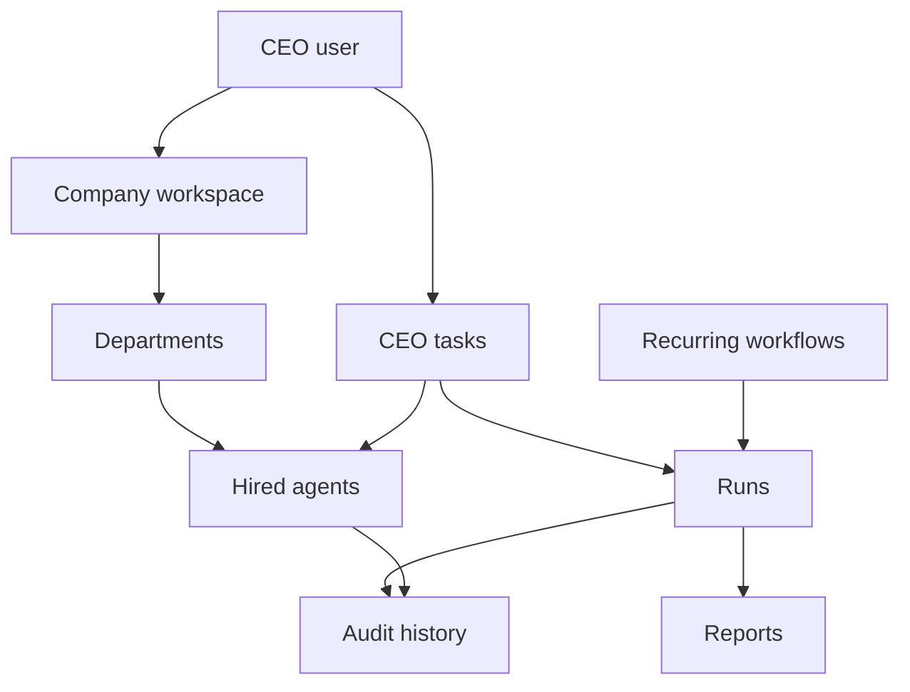
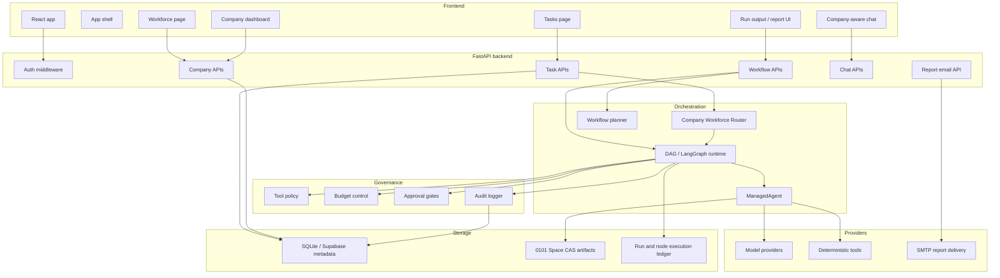
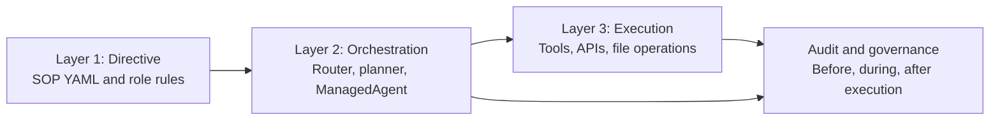
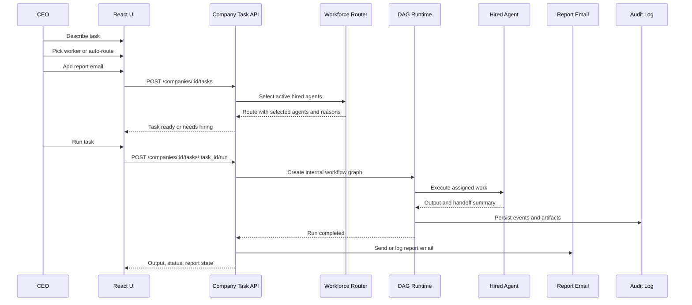
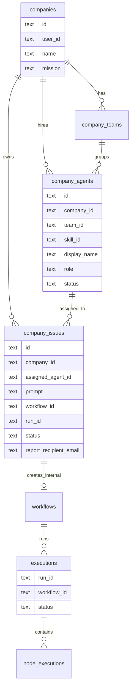

# 0101 Architecture

This is the canonical architecture document for 0101.

0101 turns AI agents into a company workforce. The user is the CEO. A company has departments, hired agents, one-time tasks, recurring workflows, runs, reports, and audit history.

## 1. Product Architecture



### Core Concepts

| Concept | Description |
| --- | --- |
| Company | Top-level user workspace |
| Department | Team grouping for agents |
| Agent | Hired AI worker backed by a skill definition |
| Task | One-time CEO assignment |
| Workflow | Reusable or scheduled operating procedure |
| Run | One execution of a task or workflow |
| Report | Final CEO-facing output, optionally emailed |
| Audit | Immutable execution and governance trace |

## 2. System Architecture



## 3. The Three-Layer Model

0101 is built around three layers.



### Layer 1: Directive

Directives define how work should be done:

- roles,
- stages,
- required inputs,
- expected artifacts,
- approval requirements,
- handoff rules.

Files live in:

```text
directives/
```

### Layer 2: Orchestration

Orchestration decides who should do the work and how it should move:

- route CEO tasks to active hired agents,
- build an internal workflow graph,
- pass handoff summaries between agents,
- enforce role isolation,
- keep the user-facing flow simple.

Key files:

```text
core/company_routes.py
core/workflow_planner.py
core/managed_agent.py
```

### Layer 3: Execution

Execution performs the actual work:

- model calls,
- deterministic tools,
- artifact writes,
- run status updates,
- report generation,
- SMTP delivery.

Key files:

```text
core/dag_engine.py
core/llm_provider.py
execution/
```

## 4. CEO Task Flow



## 5. Company Workforce Router

The router is intentionally company-scoped.

Input:

- company id,
- task prompt,
- optional department,
- optional selected agent ids,
- output type.

Rules:

1. Only active hired agents in that company can be selected.
2. Fired or disabled agents cannot receive new work.
3. If the CEO picks an agent, that worker owns the task.
4. If no agent is picked, 0101 scores active agents by role, skill, description, and capabilities.
5. If no agent fits, the API returns missing-role recommendations instead of pretending a random worker can do the job.

Output:

- selected agents,
- route quality,
- selection reasons,
- handoff order,
- output contract,
- approval gates.

## 6. Task, Workflow, And Run Relationship



Note: the compatibility table is still named `company_issues`, but product/API language calls these records `tasks`.

## 7. Report Delivery

Reports are built from:

- task title,
- task prompt,
- assigned worker,
- route explanation,
- workflow id,
- run id,
- completed node outputs,
- timestamps.

Delivery behavior:

1. If SMTP is configured, the report is sent by email.
2. If SMTP is not configured, report delivery is logged as local delivery.
3. The UI still shows report status either way.

Relevant environment variables:

```env
ENSEMBLE_SMTP_HOST=
ENSEMBLE_SMTP_PORT=587
ENSEMBLE_SMTP_FROM=reports@0101.local
ENSEMBLE_SMTP_USERNAME=
ENSEMBLE_SMTP_PASSWORD=
ENSEMBLE_SMTP_USE_TLS=true
```

## 8. Governance

Governance is always part of execution.

0101 tracks:

- who started the work,
- which company owned it,
- which agents were selected,
- which model/provider ran,
- which tools were used,
- which artifacts were produced,
- what the run cost,
- whether approval was required,
- how the run completed.

## 9. Primary Product Surfaces

| Surface | Purpose |
| --- | --- |
| Dashboard | High-level operational overview |
| Companies | Create and select company workspaces |
| Company Dashboard | CEO command center for one company |
| Workforce | Hire, inspect, and fire agents |
| Tasks | Assign one-time CEO work to agents |
| Workflows | Reusable and recurring operating procedures |
| Run Output | Agent outputs, preview, files, report, timeline |
| Chat | Company, task, run, and agent-aware conversation |
| Audit | Execution history and governance trace |
| Settings | Providers, auth, budgets, and policy |

## 10. Important Code Paths

| File | Responsibility |
| --- | --- |
| `core/governance.py` | FastAPI app, auth middleware, workflow execution endpoints |
| `core/company_routes.py` | Company, department, hired-agent, task, and report APIs |
| `core/dag_engine.py` | DAG execution, node status, run status, task completion sync |
| `core/managed_agent.py` | Agent wrapper for prompts, tools, budgets, and provider calls |
| `core/ensemble_space.py` | Content-addressable artifacts |
| `core/audit.py` | Audit logging |
| `core/skill_registry.py` | Skill catalog and agent metadata |
| `ui/src/routes/_authenticated/companies/$id.tasks.tsx` | CEO task assignment UI |
| `ui/src/routes/_authenticated/companies/$id.agents.tsx` | Workforce hiring/firing UI |
| `ui/src/lib/adapters/real.ts` | Frontend API adapter |

## 11. Design Rules

0101 should feel like a premium command center:

- matte black base,
- liquid-glass panels,
- minimal visual noise,
- clear status and ownership,
- no generic AI-app filler,
- no hidden backend magic without explanation,
- every important result linked to a run, report, file, or audit event.

The UI should keep workflow graph editing as an advanced capability. The main product path is:

```text
CEO command -> agent route -> run -> output -> report -> audit
```

