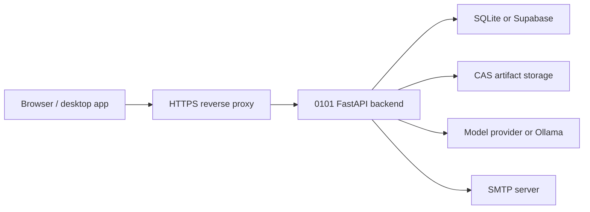

# 0101 Operations Guide

This guide covers local setup, environment variables, report email delivery, smoke tests, and common troubleshooting.

## 1. Local Setup

### Backend

Install Python dependencies:

```bash
pip install -r requirements.txt
```

Create a local `.env`:

```env
ENFORCE_AUTH=false
LLM_PROVIDER=gemini
GEMINI_API_KEY=your-key
APPROVAL_COST_THRESHOLD=0.01
APPROVAL_TIMEOUT_SECONDS=300
RATE_LIMIT_ENABLED=true
RATE_LIMIT_PER_MINUTE=100
```

For Ollama:

```env
ENFORCE_AUTH=false
LLM_PROVIDER=ollama
OLLAMA_BASE_URL=http://localhost:11434
OLLAMA_MODEL=llama3.1
```

Start the backend:

```bash
python -m uvicorn core.governance:app --host 127.0.0.1 --port 8088
```

### Frontend

```bash
cd ui
npm install
npm run dev
```

Open:

```text
http://127.0.0.1:5173
```

## 2. Useful Checks

Backend checks:

```bash
python -m pytest tests/test_company_routes.py
python -m py_compile core/company_routes.py core/governance.py core/dag_engine.py
```

Frontend checks:

```bash
cd ui
npm run build
npm run lint
```

## 3. CEO Task Smoke Test

Use this to verify the main product loop.

1. Sign in locally.
2. Create a company.
3. Open Workforce.
4. Hire at least one agent.
5. Open Tasks.
6. Enter a task prompt.
7. Select a worker or leave it on auto-pick.
8. Add a report email.
9. Keep "Email the assigned agent report when the task completes" checked.
10. Create the task.
11. Run the task.
12. Confirm the task card shows worker, run status, output link, and report delivery status.

Expected behavior:

- selected worker changes to `running` while work is active,
- run creates node execution records,
- task links to workflow id and run id,
- completed task creates a report,
- SMTP configured means email is sent,
- SMTP missing means delivery is logged locally.

## 4. SMTP Report Delivery

0101 can email CEO task reports when runs complete.

Configure:

```env
ENSEMBLE_SMTP_HOST=smtp.example.com
ENSEMBLE_SMTP_PORT=587
ENSEMBLE_SMTP_FROM=reports@yourdomain.com
ENSEMBLE_SMTP_USERNAME=your-user
ENSEMBLE_SMTP_PASSWORD=your-password
ENSEMBLE_SMTP_USE_TLS=true
```

Fallback variable names are also supported:

```env
SMTP_HOST=
SMTP_PORT=
SMTP_FROM=
SMTP_USERNAME=
SMTP_PASSWORD=
SMTP_USE_TLS=
```

If SMTP is not configured, the backend does not fail the task. It records delivery status as `logged`, which is useful for local development.

## 5. Local Data

Default local databases:

| File | Purpose |
| --- | --- |
| `data/ensemble_companies.db` | companies, departments, hired agents, tasks, report status |
| `data/ensemble_governance.db` | workflows, executions, node executions, run events |
| `data/ensemble_audit.db` | audit records |
| `data/ensemble_space/` | content-addressable artifacts |

## 6. Production Notes

Minimum production settings:

```env
ENFORCE_AUTH=true
CORS_ORIGINS=https://0101.yourdomain.com
API_KEY_ENCRYPTION_KEY=generated-fernet-key
APPROVAL_COST_THRESHOLD=0.01
APPROVAL_TIMEOUT_SECONDS=300
RATE_LIMIT_ENABLED=true
RATE_LIMIT_PER_MINUTE=100
```

Supabase mode:

```env
SUPABASE_URL=https://your-project.supabase.co
SUPABASE_ANON_KEY=...
SUPABASE_SERVICE_ROLE_KEY=...
JWT_SECRET=...
```

## 7. Deployment Shape



## 8. Manual Backend Deployment

```bash
python3.11 -m venv /opt/0101/venv
source /opt/0101/venv/bin/activate
pip install -r requirements.txt
gunicorn core.governance:app \
  --bind 0.0.0.0:8088 \
  --workers 4 \
  --worker-class uvicorn.workers.UvicornWorker \
  --timeout 120
```

## 9. Reverse Proxy Example

```nginx
server {
    listen 443 ssl;
    server_name 0101.yourdomain.com;

    ssl_certificate /etc/letsencrypt/live/0101.yourdomain.com/fullchain.pem;
    ssl_certificate_key /etc/letsencrypt/live/0101.yourdomain.com/privkey.pem;

    location / {
        proxy_pass http://localhost:8088;
        proxy_set_header Host $host;
        proxy_set_header X-Real-IP $remote_addr;
        proxy_set_header X-Forwarded-For $proxy_add_x_forwarded_for;
        proxy_set_header X-Forwarded-Proto $scheme;
        proxy_http_version 1.1;
        proxy_set_header Upgrade $http_upgrade;
        proxy_set_header Connection "upgrade";
    }
}
```

## 10. Troubleshooting

| Problem | Likely fix |
| --- | --- |
| UI cannot reach backend | Confirm backend runs on `127.0.0.1:8088` and CORS includes the UI origin |
| Login works but data disappears after restart | Check auth mode and local account headers; local mode should use stable `local-account:*` ownership |
| Cannot hire an agent | Confirm `/api/skills` returns catalog entries and the backend has the latest company routes |
| Task says `needs_hiring` | Hire an active agent that matches the task or explicitly choose a worker |
| Report email says `logged` | SMTP is not configured; add SMTP environment variables |
| Report email says `failed` | Check SMTP host, port, credentials, TLS, and sender policy |
| Run output 404s | Confirm the task has a `run_id` and the execution exists in the governance database |
| Provider call fails | Check model provider settings and API key |

## 11. Release Checklist

- [ ] Backend starts cleanly
- [ ] Frontend starts cleanly
- [ ] Company can be created
- [ ] Agent can be hired
- [ ] Agent can be fired without losing old task history
- [ ] CEO task can be assigned to a selected worker
- [ ] CEO task can auto-route to hired agents
- [ ] Task run links task, workflow, and run ids
- [ ] Completed task creates report state
- [ ] SMTP report delivery works or logs locally
- [ ] Audit records are visible
- [ ] `npm run build` passes
- [ ] `npm run lint` has no errors
- [ ] Backend tests pass
